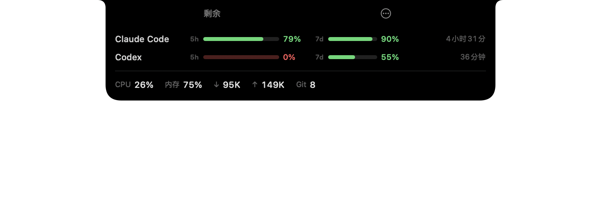

# NotchDash

在 MacBook 刘海下方显示 Claude Code / Codex 的额度、系统状态和股票指数。

[English](README.en.md)

## 效果

收起时只在刘海旁显示关键数字，和刘海的黑色连成一片：


鼠标移上去展开完整面板：



## 功能

- **额度**：Claude Code 与 Codex 的剩余或已用百分比、重置倒计时，按状态变色。额度耗尽时改为显示恢复时间
- **系统状态**：CPU、内存、实时网速
- **股票指数**：A 股、港股、美股，按涨跌上色，红涨绿跌和绿涨红跌都支持
- **轮播**：收起态可在额度与行情之间轮换，面板宽度保持不变
- **自定义数据源**：显示任意 shell 命令的输出

没装 Claude Code 或 Codex 也能用，只拿它看指数就行。

## 安装

### 下载发布版

从 [Releases](https://github.com/zoglmk/NotchDash/releases) 下载 zip，解压后把 `NotchDash.app` 拖进「应用程序」，双击打开。

首次打开会提示「已损坏，无法打开」，这是未签名应用的统一措辞，处理方式见下方常见问题。

### 从源码构建

只需要 Command Line Tools，不必安装完整 Xcode。

```bash
xcode-select --install          # 若尚未安装
git clone https://github.com/zoglmk/NotchDash.git
cd NotchDash
./install.sh                    # 构建并安装到 /Applications
./install.sh --autostart        # 同时注册开机自启
```

从源码构建的版本不会被 Gatekeeper 拦截。

### 打开之后

不需要任何配置，额度、系统状态和股票指数会直接显示出来。首次读取额度时系统可能弹出钥匙串授权窗口，点「允许」即可，程序用它读取 Claude Code 已有的登录态来查额度，不保存也不转发。

其余选项都在右键菜单里：股票指数、轮播、涨跌配色、收起态排布、显示模式。想调得更细，或者不希望联网读凭据，见[配置与进阶](docs/configuration.md)。

## 常见问题

### 提示「已损坏，无法打开」

本项目未做 Apple 签名和公证（需要每年 99 美元的开发者账号），从网络下载的版本会被 Gatekeeper 拦截。文件本身没有损坏。

命令行解除：

```bash
xattr -dr com.apple.quarantine /Applications/NotchDash.app
```

或者走系统设置：双击应用，在提示框中点「完成」，打开「系统设置」→「隐私与安全性」，向下滚动到「安全性」一节，点击「仍要打开」，再次确认。

macOS 15 起，右键点击图标选「打开」的老办法已失效。

### Claude Code 显示「等待刷新状态栏」

两条通道都没取到数据。运行 `NotchDash --probe-oauth` 看失败原因，通常是钥匙串授权被拒绝或登录态已过期，重新登录 Claude Code 即可。如果关掉了 `oauth_fallback`，则必须配置 statusline，见[配置与进阶](docs/configuration.md)。

刚打开 Claude Code 还没发过消息时也会这样，发一条就有了。

### 面板遮挡菜单栏图标

菜单栏图标从右向左排，右侧排满后会跳过刘海在左侧继续排，所以左侧也可能和面板打架。在 `⋯` 菜单的「收起态排布」里切换：

| 排布 | 说明 |
|---|---|
| 全部靠左（默认） | 面板只向刘海左侧伸出，不占用右侧 |
| 刘海正下方 | 完全不占菜单栏那一行，但会遮住窗口顶部约 21pt |

左侧被图标占满时切到正下方即可，那个位置不会和任何图标冲突。

### 如何退出

在面板上右键，或展开后点右上角 `⋯`，选「退出 NotchDash」。也可以执行 `pkill -f NotchDash`。

## 卸载

```bash
./uninstall.sh
```

停止进程、移除开机自启和应用，并还原 `~/.claude/settings.json` 中的状态栏配置。配置与缓存目录 `~/.notchdash/` 会保留。

## 更多

- [配置与进阶](docs/configuration.md)：配置字段、股票代码、statusline 通道、数据来源与隐私、调试命令
- 要求 macOS 13 或更高版本，无刘海的机型也能用，面板显示在屏幕顶部居中

## 许可

MIT
